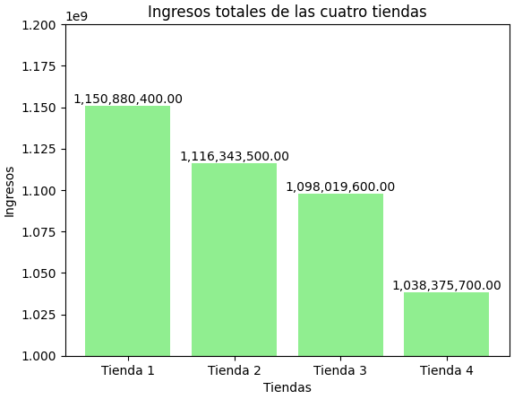
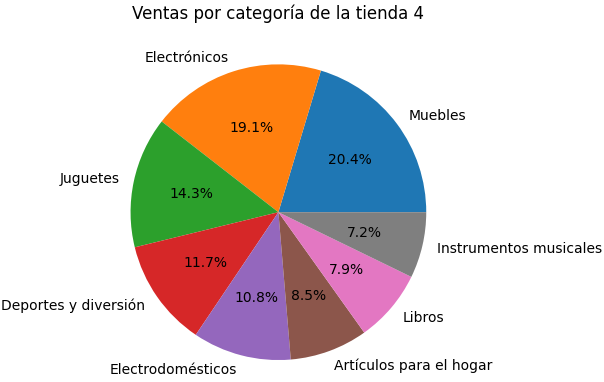
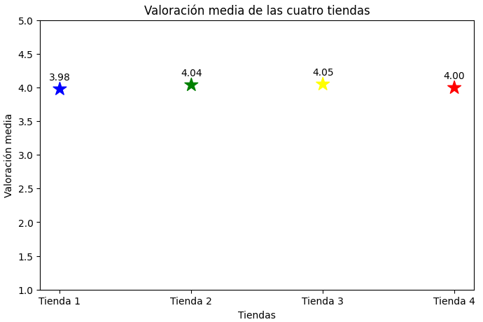
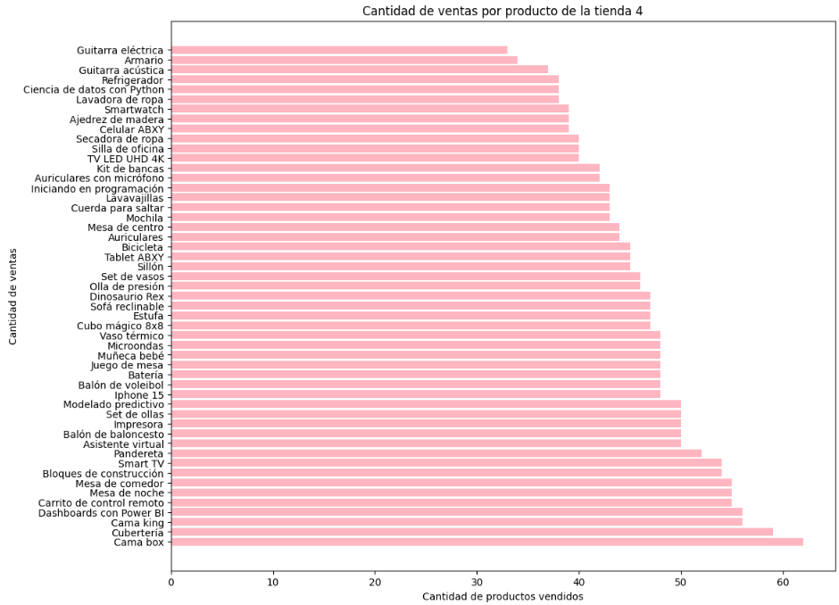
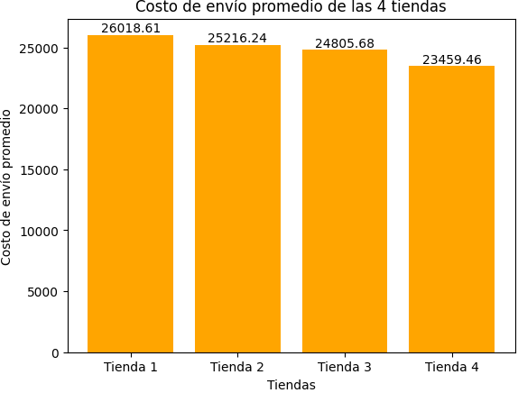

# Análisis de Ventas - Alura Store 

## Propósito del Proyecto

Este proyecto tiene como objetivo analizar los datos de ventas de las **4 tiendas de la cadena Alura Store** para ayudar al Sr. Juan a tomar una decisión estratégica sobre **qué tienda debería vender** para iniciar un nuevo emprendimiento.

A través del análisis de datos se busca identificar la tienda con **menor rendimiento** considerando diferentes métricas como:

* Ingresos totales
* Categorías de productos más vendidas
* Productos más vendidos
* Calificaciones y reseñas de clientes
* Promedio de costos de envío

El análisis se realiza utilizando **Python**, principalmente las librerías **Pandas** para manipulación de datos y **Matplotlib** para visualización.

---
# Fuente de los Datos

Los datos utilizados en este proyecto provienen del repositorio público del desafío Alura Latam Data Science Challenge.

Los datasets se cargan directamente desde las siguientes URLs:

* https://raw.githubusercontent.com/alura-es-cursos/challenge1-data-science-latam/refs/heads/main/base-de-datos-challenge1-latam/tienda_1%20.csv
* https://raw.githubusercontent.com/alura-es-cursos/challenge1-data-science-latam/refs/heads/main/base-de-datos-challenge1-latam/tienda_2.csv
* https://raw.githubusercontent.com/alura-es-cursos/challenge1-data-science-latam/refs/heads/main/base-de-datos-challenge1-latam/tienda_3.csv
* https://raw.githubusercontent.com/alura-es-cursos/challenge1-data-science-latam/refs/heads/main/base-de-datos-challenge1-latam/tienda_4.csv

---
# Tecnologías Utilizadas

* Python
* Pandas
* Matplotlib
* Google Colab

---

# Estructura del Proyecto

```bash
challenge-python-DS-alura/
│
├── notebook/
│   └── AluraStoreLatam.ipynb
│
├── images/
│   ├── IngresosT.png
│   ├── CategoriasT1.png
│   ├── CategoriasT2.png
│   ├── CategoriasT3.png
│   ├── CategoriasT4.png
│   ├── ValoracionM.png
│   ├── VentasT1.png
│   ├── VentasT2.png
│   ├── VentasT3.png
│   ├── VentasT4.png
│   └── CostoEnvioP.png
│
└── README.md
```
---

# Análisis de Datos

Durante el análisis se evaluaron diferentes indicadores para medir el rendimiento de cada tienda. Algunos ejemplos de estos son:

## Ingresos Totales por Tienda

* Tienda 1: $1,150,880,400.00
* Tienda 2: $1,116,343,500.00
* Tienda 3: $1,098,019,600.00
* Tienda 4: $1,038,375,700.00

**Gráfico de ingresos**

[Inserta aquí la imagen del gráfico]

```markdown

```

---

## Categorías de Productos Más Vendidas

Se analizó qué categorías generan más ventas en cada tienda.

Principales categorías:
* Electrónicos
* Muebles
* Juguetes

 **Gráfico de categorías de la tienda 4**

```markdown

```

---

## Calificaciones Promedio de Clientes

Se analizaron las reseñas de clientes para medir la satisfacción con cada tienda.

Resultados:

* Tienda 1: 3.98
* Tienda 2: 4.04
* Tienda 3: 4.05
* Tienda 4: 4.0

**Gráfico de calificaciones**

```markdown

```

---

## Productos Más Vendidos

Se identificaron los productos con mayor número de ventas en cada tienda.

Ejemplo:

Productos más vendidos de la tienda 4:
* Cama box
* Cubetería
* Cama king/Dashboards con Power BI

Productos menos vendidos de la tienda 4:
* Guitarra eléctrica
* Armario
* Guitarra acústica
---

**Gráfico de productos vendidos de la tienda 4**

```markdown

```

---

## Promedio de Costos de Envío

Se analizó el costo promedio de envío por tienda para evaluar el impacto en las ventas.

Resultados:

* Tienda 1: $26,018.61
* Tienda 2: $25,216.24
* Tienda 3: $24,805.68
* Tienda 4: $23,459.46

 **Gráfico de costos de envío**

```markdown

```
---

# Insights Obtenidos

Algunos hallazgos importantes del análisis:

* El análisis de los ingresos totales muestra que la tienda con mayores ingresos totales es la Tienda 1, la segunda es la Tienda 2, la tercera es la Tienda 3 y la de menores ingresos totales es la la Tienda 4.
* El análisis de la valoración media de las 4 tiendas muestra que la que tiene mayor calificación por parte de los clientes es la Tienda 3, después es la Tienda 2, la tercera es la Tienda 4 y la que tiene menor calificación es la Tienda 1:
* El análisis de las ventas por categoría de las 4 tiendas muestra que las 4 tiendas tienen cantidades de ventas por producto similares tanto en sus productos mas vendidos como los menos vendidos. Sin embargo, también muestra que losproductos más populares y menos populares de cada tienda son diferentes.
* El análisis del costo de envío promedio de las 4 tiendas muestra que la tienda con un mayor costo de envío promedio es la Tienda 1, la segunda es la Tienda 2, la tercer es la Tienda 3 y la de menor es la Tienda 4.

# Recomendación Final

Después de analizar los cinco puntos presentados en este proyecto, cada tienda destaca en ciertas métricas mientras y presenta debilidades en otras. Por ello, en la toma de decisión se dio prioridad a las métricas con mayor impacto financiero. Por lo tanto, la recomendación final es que el Sr. Juan **considere vender la Tienda 4**.

---
# Cómo Ejecutar el Notebook

El análisis fue desarrollado en Google Colab, por lo que puede ejecutarse directamente desde el navegador sin necesidad de descargar los datasets, ya que los datos se cargan desde URLs públicas.

1. Clonar este repositorio:

* git clone https://github.com/TU_USUARIO/alura-store-analysis.git

2. Ir a Google Colab
https://colab.research.google.com/

* Seleccionar:
  * File → Upload Notebook
  * Subir el archivo:
  * notebook/alura_store_analysis.ipynb
  * Entorno de ejecución → Ejecutar todo


#  Autor

Proyecto realizado por:

**Miguel Venegas Rocha**

Como parte del desafío de **análisis de datos con Python de Alura**.

---
